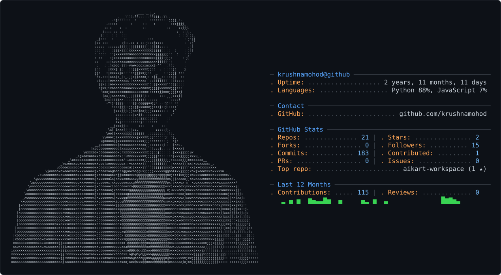

<picture>
  <source media="(prefers-color-scheme: dark)" srcset="dark_mode.svg" />
  <source media="(prefers-color-scheme: light)" srcset="light_mode.svg" />
  
</picture>

# Hi there, I'm Krushna Mohod! 👋

**Full-Stack AI Engineer | Systems Architect | AI & IoT Innovator**

🚀 **Building intelligent, scalable applications**—from autonomous AI agents and enterprise knowledge engines to cloud-native platforms and IoT/hardware solutions.  
🎯 **Current Focus:** Architecting multi-agent sandbox platforms, mastering cloud-native distributed systems (AWS ECS Fargate, Serverless), and refining AI agent guardrails.

---

## 🔧 Tech Stack

### Languages & Frameworks

### AI, Machine Learning & Agent Systems

### Cloud, DevOps & Databases

---

## 🌟 Featured Projects

- **[aiKart AI Marketplace](https://github.com/krushnamohod/aiKart)**  
  *Full-stack platform (Next.js 16, React 19, Tailwind v4, AWS ECS Fargate, PostgreSQL) enabling users to list, discover, buy, and execute AI agents in isolated runtime sandboxes with AES-256 encrypted secrets and Gemini intent search.*

- **Munven AI (Company Knowledge Brain)**  
  *Enterprise AI knowledge engine capturing team context, architectural decisions, and task history for seamless employee onboarding and zero-knowledge-loss offboarding.*

- **SL-5 (AI Lead Qualification Agent)**  
  *CRM-neutral, rules-first lead qualification agent pairing LLM conversational context extraction with a deterministic business rules engine for lead scoring and routing.*

- **E-Commerce AI Assistant (Ecom-Assist)**  
  *Context-aware retail assistant built with strict guardrails, prompt enforcement, and explicit customer confirmation flows for order modifications.*

- **[Knowledge Insight Hub](https://github.com/krushnamohod/Knowledgeinsight_hub)**  
  *Transforms raw CSV data into interactive visual insights and actionable analytics dashboards.*

- **Device for the Deaf and Hard of Hearing**  
  *Assistive hardware solution featuring voice-to-vibration translation with bone conduction and real-time language translation.*

- **[Face Recognition Attendance System](https://github.com/krushnamohod/Face_Recognition)**  
  *Automated attendance tracking using computer vision face detection and automated CSV exports.*

---

## 🏆 Highlights
- 📜 **Intel Unnati Industrial Training Participant** (2023-24)  
- 🎉 **Core Committee Member**, SGBAU Youth Festival  
- 🤝 **Member**, GDG On-Campus AIML Domain  

---

## 📈 GitHub Stats & Activity
  
  

---

## 📬 Let's Connect!
  

---

*“Code, innovate, and make an impact!”*
